# Sari-Sari Store Management System

Sari-Sari Store Management System is a complete, production-ready Point of Sale (POS) and business management solution specifically designed for Filipino sari-sari stores and small retail businesses. Built with modern web technologies, it provides everything needed to run a neighborhood store efficiently.

## 🎯 Purpose
This system was created to address the unique needs of Filipino sari-sari stores, particularly:  
• Utang Management - Track customer credit ("utang"), a common practice in Filipino neighborhood stores  
• Simple Operations - Easy-to-use interface for non-technical store owners  
• Offline-First - Works on local network without requiring internet connectivity  
• Cost-Effective - Free and open-source, runs on any PC  

## ✨ Key Features
### 💰 Point of Sale (POS)
• Quick product search and selection  
• Shopping cart with quantity controls  
• Multiple payment methods: Cash, GCash, and Credit (Utang)  
• Customer selection for credit sales  
• Real-time inventory updates  
• Receipt printing  
• Fast checkout process  

### 📦 Inventory Management
• Complete product CRUD operations  
• CSV bulk import/export  
• Low stock and out-of-stock alerts  
• Reorder level monitoring  
• Cost and price tracking for profit calculations  
• Category organization  
• Stock quantity management  

### 👥 Customer Management
- Customer database with contact information  
- Utang (Credit) System:  
  - Track customer balances (negative = debt, positive = prepaid credit)  
  - Record payments with cash or GCash  
  - Payment history and audit trail  
  - Automatic balance calculations  
- Duplicate prevention (unique phone numbers)  
- Search and pagination  

### 📊 Sales & Analytics
• Complete transaction history  
• Date range filtering (today, week, month, custom)  
• Payment method breakdown  
• Profit tracking (revenue - cost)  
• Top-selling products analysis  
• Detailed sale views with itemization  

### 📈 Reports & Business Intelligence
- Interactive Charts:  
  - Sales trend over time (line chart)  
  - Top 10 products by revenue (bar chart)  
  - Payment method distribution (doughnut chart)  
- Key Metrics Dashboard:  
  - Total revenue and profit  
  - Profit margins  
  - Transaction counts  
  - Customer statistics  
- Export Capabilities:  
  - PDF reports with professional formatting  
  - Excel spreadsheets for further analysis  
  - Print-optimized layouts  

### 🔐 User Management & Security
- Authentication:  
  - JWT-based secure login  
  - Password hashing (bcryptjs)  
  - HttpOnly cookies for XSS protection  
  - Rate limiting (5 attempts per 15 minutes)  
- Role-Based Access Control:  
  - Admin: Full system access, user management  
  - Cashier: POS and basic operations  
- User Features:  
  - Profile management  
  - Password change  
  - Activity tracking  

### 🏠 Dashboard
- Real-time business metrics:  
  - Today's sales and transaction count  
  - Total products in inventory  
  - Low stock and out-of-stock alerts  
  - Total outstanding utang  
- Recent sales activity feed  
- Alert notifications panel  
- Quick action shortcuts  

### 🛠️ Technology Stack
- Frontend  
• Next.js 15 - React framework with App Router  
• TypeScript - Type-safe development  
• Tailwind CSS - Modern, responsive UI  
• Chart.js - Interactive data visualizations  
• React Hot Toast - User notifications  

- Backend  
• Next.js API Routes - RESTful API endpoints  
• Prisma ORM - Type-safe database queries  
• SQLite - Lightweight, file-based database  
• bcryptjs - Secure password hashing  
• jsonwebtoken - JWT authentication  

- Additional Libraries  
• jsPDF & jspdf-autotable - PDF generation  
• ExcelJS - Excel file creation  
• Papaparse - CSV processing  
• Lucide React - Beautiful icons  

## 📸 Screenshots
Here are some of the screenshots showcasing the system user interface.  
All images are stored in the `assets/` directory of this project.  

### Login
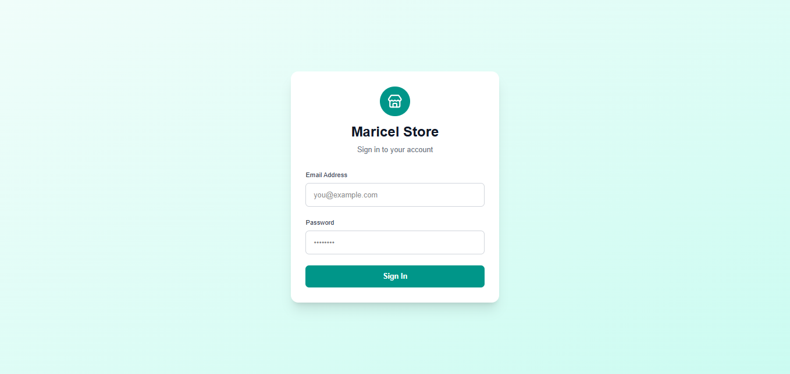

### Dashboard
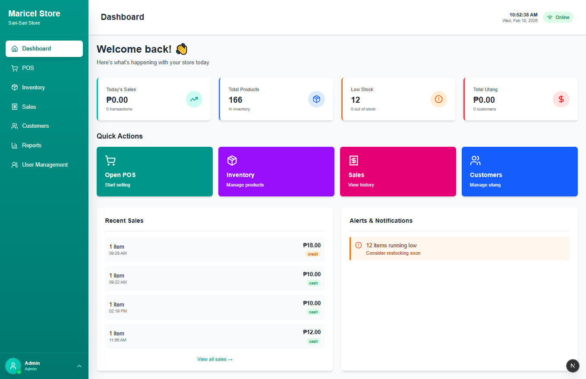

### POS
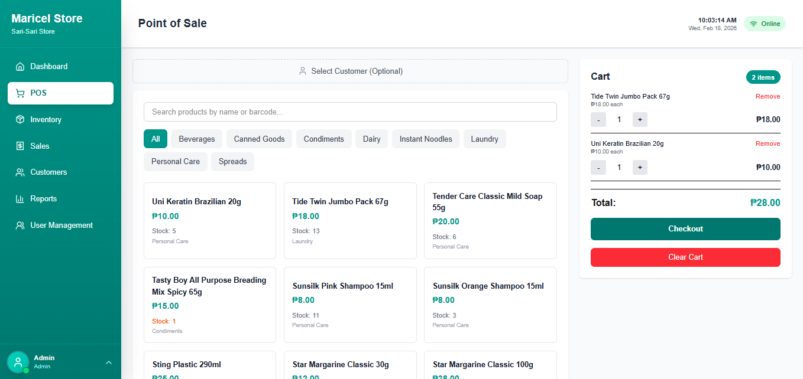
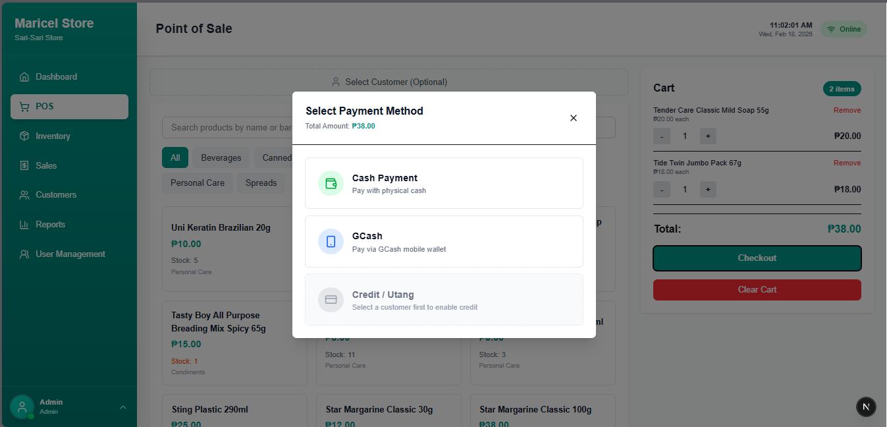
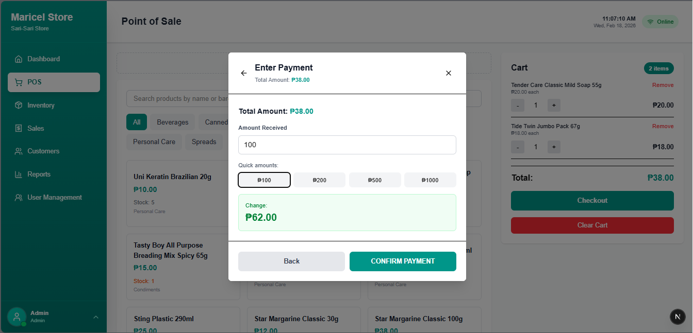
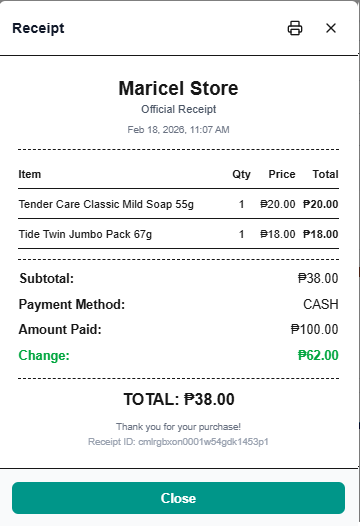

### Inventory
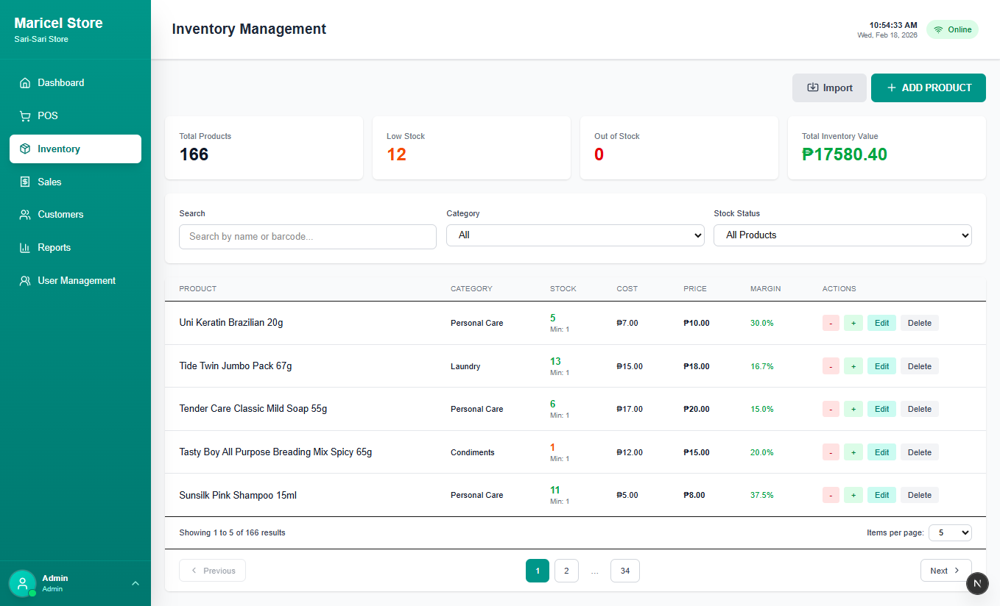

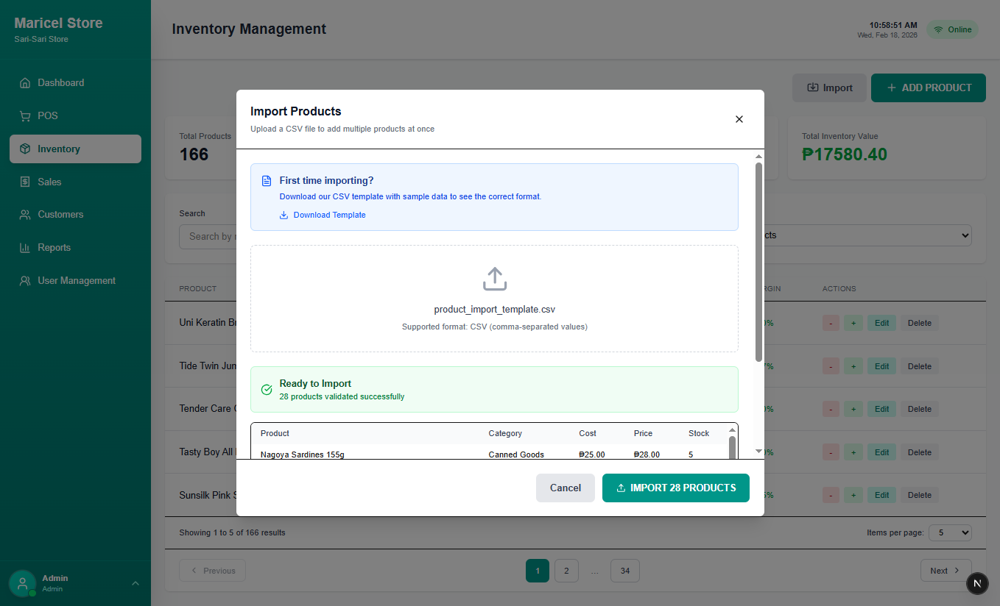

### Sales
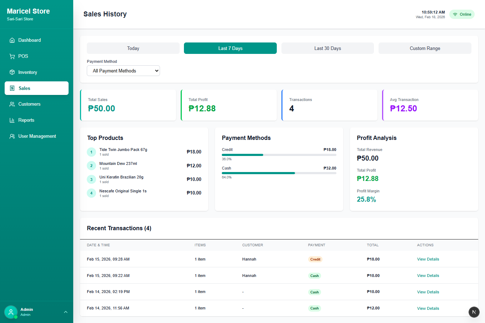

### Customer Management
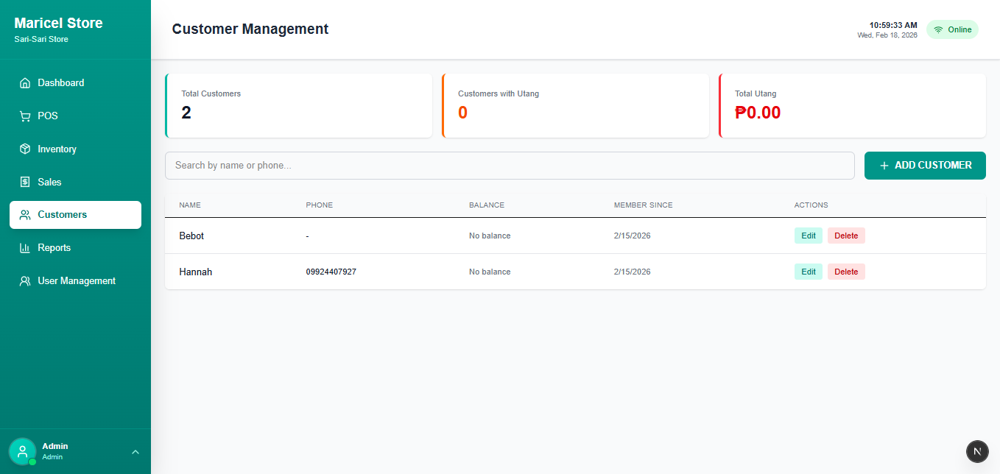
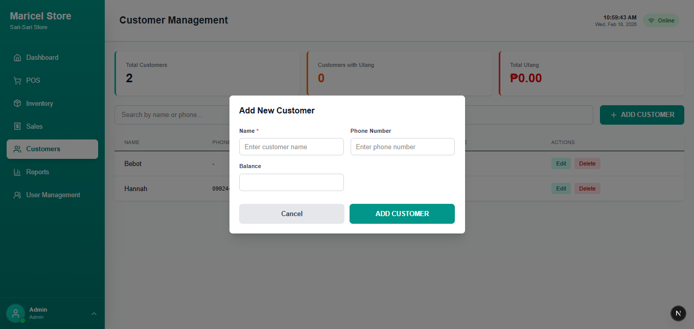

### Reports
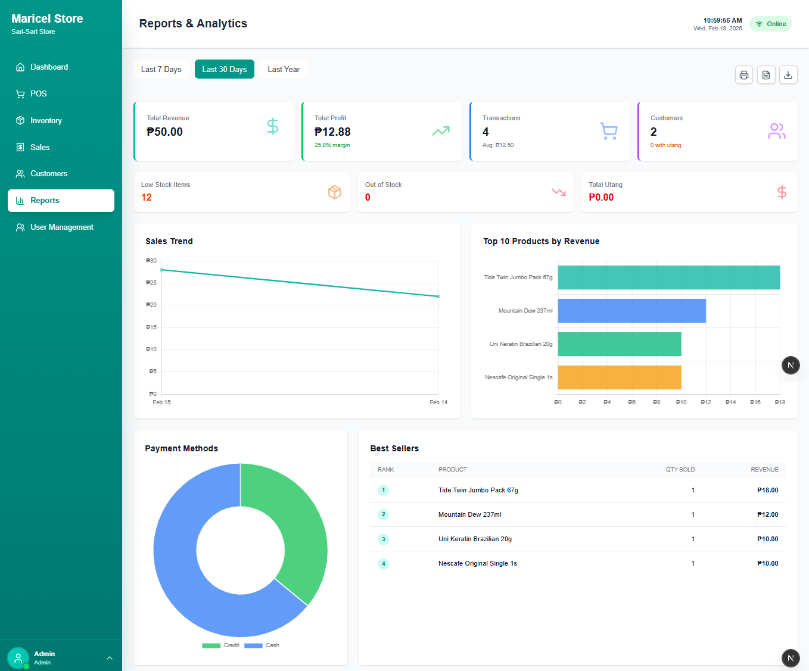

### User Management (Admin only)

Made for Maricel Store with ❤️
